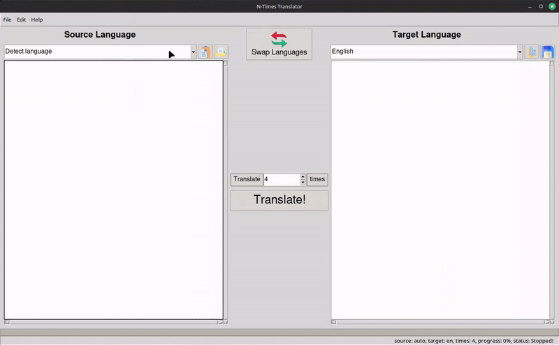
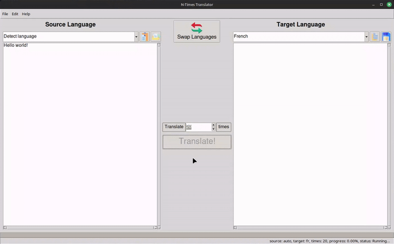

# Introduction
>
> N-Times Translator is a free and open source program that takes a text in any language, sends it through Google Translate a bunch of times, and then outputs it in any language.

## Table of Contents

* [Requirements](#-requirements)
* [Installation](#-installation)
* [Usage](#-usage)
* [To Do](#-to-do)
* [Attribution](#️-attribution)

## 💻 Requirements

* Python 3.x or newer

## 🚀 Installation

Clone this repository and cd into source repository:

```bash
git clone https://github.com/danillo-de-paula-ss/N-Times-Translator.git
cd N-Times-Translator
```

Then install the dependencies:

```bash
pip install -r requirements.txt
```

Note: Windows users can download an .exe file in [Releases](https://github.com/danillo-de-paula-ss/N-Times-Translator/releases) and place it in any location on their [PATH](https://en.wikipedia.org/wiki/PATH_%28variable%29) except for %SYSTEMROOT%\System32 (e.g. do not put in C:\Windows\System32). The .exe program file doesn't need Python installed.

## ☕ Usage

Inside the source repository, run the file `nxt.py` with this command:

```bash
python nxt.py
```

Then a window will open:


Select the source language in the combobox:



Write the text you want to translate in the field below the combobox:


Then select the target language in the other combobox:


Choose the number of translations to be made in the spin field:


And finally click the "Translate!" button:


Now just wait for the program to finish making all the translations and then it will print in the field below the target language combobox:



## 📋 To Do

* Add functionality to randomize languages ​​in the translation process.
* Add the functionality of changing the program language.
* Add Brazilian Portuguese to the program language.

## 🏆️ Attribution

*  [Paste icons created by Freepik - Flaticon](https://www.flaticon.com/free-icons/paste)
*  [Open source icons created by Freepik - Flaticon](https://www.flaticon.com/free-icons/open-source)
*  [Copy icons created by Ongicon - Flaticon](https://www.flaticon.com/free-icons/copy)
*  [Save icons created by Freepik - Flaticon](https://www.flaticon.com/free-icons/save)
*  [Swap icons created by Freepik - Flaticon](https://www.flaticon.com/free-icons/swap)
